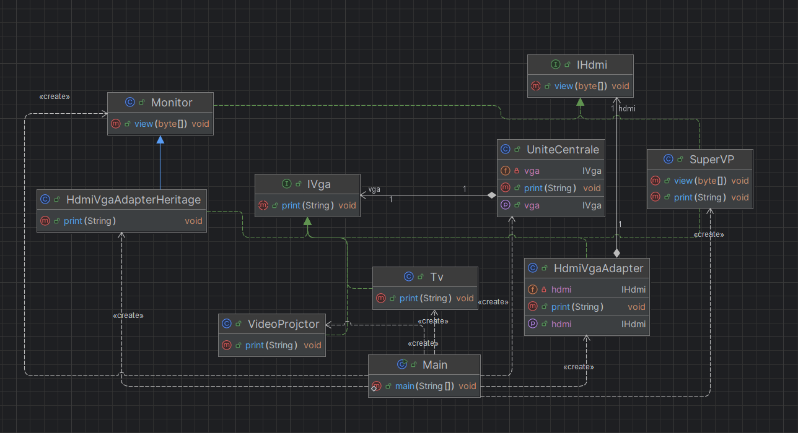
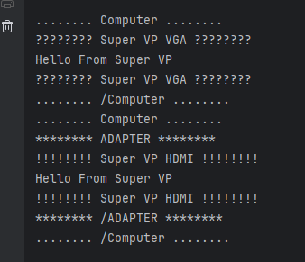
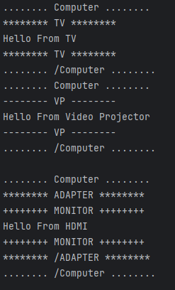

# 🧩 Activité Pratique – Implémentation du Design Pattern **Adapter** en Java

Ce dépôt présente une implémentation pratique du **Design Pattern Adapter** en Java. Cette activité fait partie du cours de **Design Patterns** encadré par **Mr YOUSSFI Mohamed**.

## 📘 Aperçu du projet

### Design Pattern Adapter
- **Objectif** : Illustrer l’utilisation du pattern **Adapter** permettant à deux interfaces incompatibles de fonctionner ensemble. L’adaptateur convertit un signal **HDMI** en signal **VGA** sans modifier les classes existantes.
- **Technologies utilisées** :
  - `Java` (Programmation Orientée Objet)
  - Compatible avec tout IDE Java

## 🧱 Structure du projet

### 📦 Package `computer`
Contient les interfaces et classes représentant les composants informatiques :

- **Interfaces**
  - `IVGA` → méthode `print(String message)`
  - `IHDMI` → méthode `view(bytes[] data)`

- **Classes**
  - `Tv` (VGA)
  - `VideoProjector` (VGA)
  - `SuperVP` (HDMI + VGA)
  - `Monitor` (HDMI)
  - `UniteCentrale` (sortie HDMI uniquement)

---

### 📦 Package `adapter`
Contient les adaptateurs permettant l'interconnexion HDMI → VGA :

- `HdmiVgaAdapter` → Adapter **par composition**
- `HdmiVgaAdapterHeritage` → Adapter **par héritage**

---

## ⚙️ Fonctionnalités principales
1. Connexion d’une **UniteCentrale (HDMI)** à des périphériques VGA.
2. Deux techniques d’adaptation :
   - ✅ Composition  
   - ✅ Héritage  
3. Illustrations par captures d’exécution.
4. Application du principe Open/Closed (OCP) et réduction du couplage.

---

## 🧩 Diagramme du Pattern Adapter


---

## 🖼️ Adaptation par Composition
| SuperVP HDMI/VGA | Adaptateur (Composition) |
|---|---|
|||

---

## 🖼️ Adaptation par Héritage
| Résultat d'exécution |
|---|
||

---

## 🚀 Comment Exécuter
```bash
git clone https://github.com/ouss-issib/design-pattern-adapter-java.git
cd design-pattern-adapter-java
mvn clean install
mvn javafx:run
